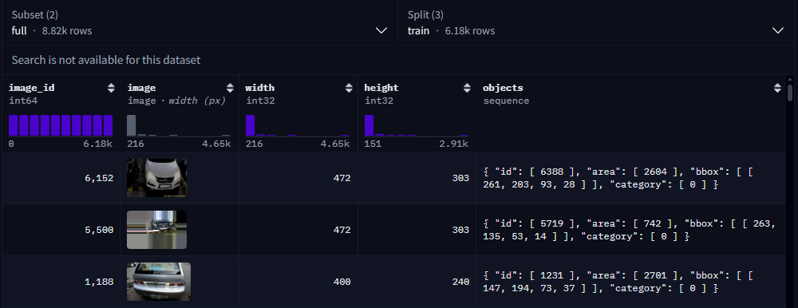
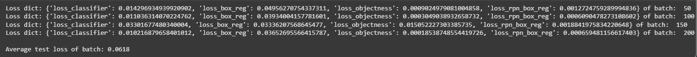
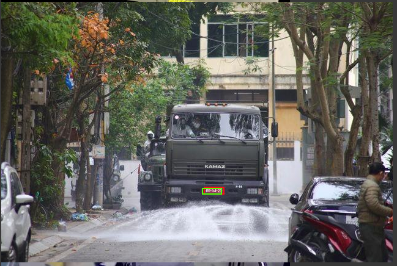
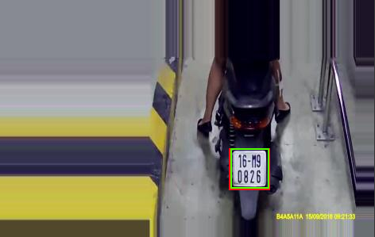
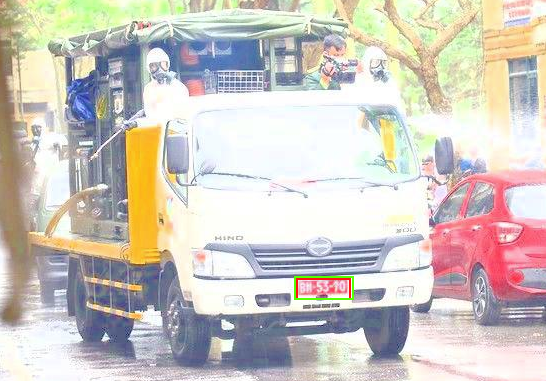
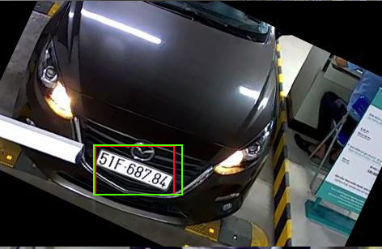
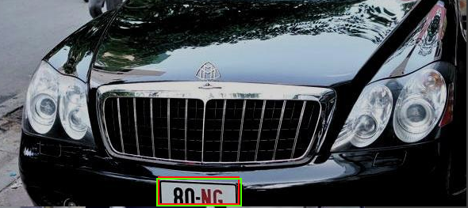
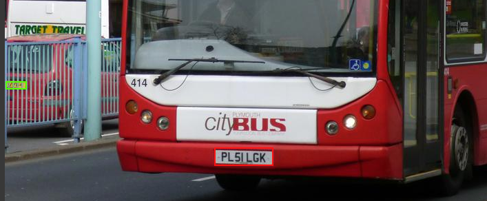
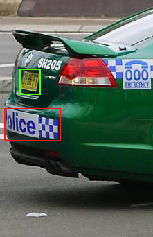
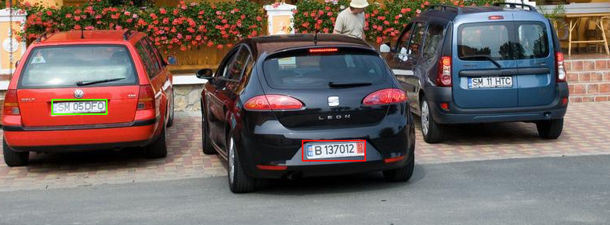

# Licence plate object detection

## Table of Contents
- [Description](#description)
- [Data description](#data-description)
- [My Approach](#my-approach)
- [Model Architecture](#model-architecture-in-detail)
- [Evaluation of the model](#evaluation-of-the-model)
- [Limitations](#limitations)
- [How to run the code](#how-to-run-the-code)
- [License](#license)
- [Author](#author)

## Description
This is one of my project in university. The goal of this project is to make a regression deep learning model that can predict the bounding box of license plates on cars.

## Data description
The data a public dataset on hugging face which you can find in this link 
https://huggingface.co/datasets/keremberke/license-plate-object-detection

The data have more than 8000 which have already been augumentated.
Data format:  
`{'image_id', 'image', 'width', 'height', objects : { 'id', 'area', 'bbox', 'category'} }`

## My Approach
* For this object detection problem, I am using `fasterrcnn_restnet_50_fpn` model with the pretrained weights on the COCO dataset.
* The model data architecture is the combination of the `resnet-50` (redidual netwrok) backbone and the `FPN` (Feature pyramid network) head
* I have recustomized the aspect ratio for license plate since it has relatively bigger width compare to the height:  
    `(anchor_sizes = ((32,), (64,), (128,), (256,), (512,)))` 
    `aspect_ratios = ((0.25, 0.5, 1.0, 2.0, 4.0),) * len(anchor_sizes)`
* Loss of the model will be the total of `{'loss_classifier', 'loss_box_reg', 'loss_objectness', 'loss_rpn_box_reg'} `

## Model architecture in detail

| **Layer (type)**                         | **Output Shape**                  | **Connected to** |
| ---------------------------------------- | --------------------------------- | ---------------- |
| `input_1 (InputLayer)`                   | (None, 3, H, W)                   | —                |
| **Transform (GeneralizedRCNNTransform)** | Normalize + Resize                | input_1          |
| **Backbone (ResNet + FPN)**              | —                                 | transform        |
| ├─ `conv1 (Conv2d)`                      | (None, 64, H/2, W/2)              | input_1          |
| ├─ `bn1 (FrozenBatchNorm2d)`             | (None, 64, H/2, W/2)              | conv1            |
| ├─ `relu (ReLU)`                         | (None, 64, H/2, W/2)              | bn1              |
| ├─ `maxpool (MaxPool2d)`                 | (None, 64, H/4, W/4)              | relu             |
| ├─ `layer1 (Bottleneck ×3)`              | (None, 256, H/4, W/4)             | maxpool          |
| ├─ `layer2 (Bottleneck ×4)`              | (None, 512, H/8, W/8)             | layer1           |
| ├─ `layer3 (Bottleneck ×6)`              | (None, 1024, H/16, W/16)          | layer2           |
| ├─ `layer4 (Bottleneck ×3)`              | (None, 2048, H/32, W/32)          | layer3           |
| └─ **FPN (Feature Pyramid Network)**     | [(P2–P5), each (None, 256, h, w)] | layer1–4         |
| **Region Proposal Network (RPN)**        | —                                 | FPN              |
| ├─ `conv (Conv2d + ReLU)`                | (None, 256, h, w)                 | FPN              |
| ├─ `cls_logits (Conv2d)`                 | (None, 5, h, w)                   | conv             |
| └─ `bbox_pred (Conv2d)`                  | (None, 20, h, w)                  | conv             |
| **ROI Heads**                            | —                                 | RPN              |
| ├─ `box_roi_pool (MultiScaleRoIAlign)`   | (None, 256, 7, 7)                 | RPN              |
| ├─ `fc6 (Linear)`                        | (None, 1024)                      | box_roi_pool     |
| ├─ `fc7 (Linear)`                        | (None, 1024)                      | fc6              |
| ├─ `cls_score (Linear)`                  | (None, 2)                         | fc7              |
| └─ `bbox_pred (Linear)`                  | (None, 8)                         | fc7              |

## Evaluation of the model:
* Loss dict & Average loss perbatch of 4:
  
* mAp (Mean Average Precision) Score with IoU threshold 0.5 and 0.75:  
  `'map_50': tensor(0.9798), 'map_75': tensor(0.8414)`
* Example images of the correct prediction:  
    
    
    
    
    

* Example images of the wrong prediction:  
    
    
    
 
## Limitations:
* Misprediction on images that have license-like character sequences
* The model is only train for 1 license plate per image `(iscrowd: 0)`

## How to run the code:
* Option 1: Using the **notebook**  
 `Take the notebook and run it on kaggle or google colab to take advantages of the GPU`     
 `Take the state_dict() the model in this link`:  
  https://drive.google.com/drive/folders/1w42VspjwLaoxf7Gt0TtQB03LiNGMWz28?usp=sharing
   
* Option 2: Run the code **locally**  
  Clone the repository: `git clone https://github.com/TrueNguyen203/License-plate-object-detection.git`  
  Create the virtual environment and install **requirementst.txt**: `pip install -r requirements.txt`  
  Training: `python trainning.py`  
  Calculate `loss_dict()`: `python inference_loss_dict.py`  
  Calculate `mAP score`: `python inference_mAP.py`  

## License

This project is licensed under the MIT License - see the LICENSE.md file for details

##  Author
- Chu Cao Nguyen - nguyenmilan203@gmail.com
  
